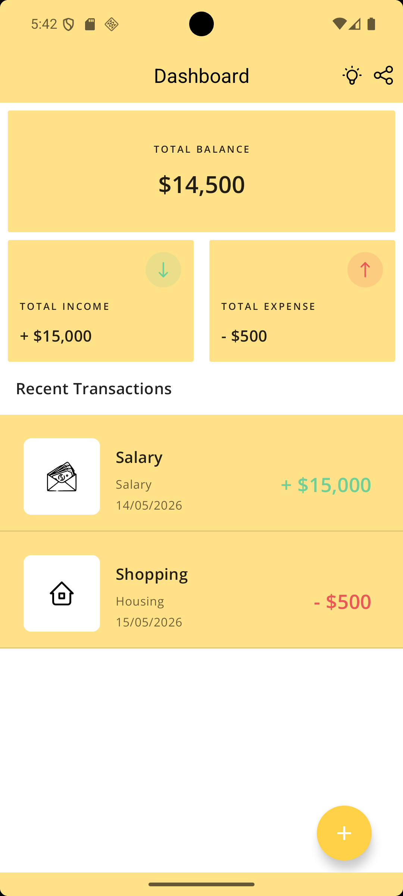
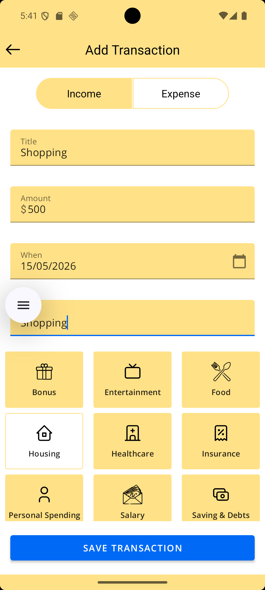
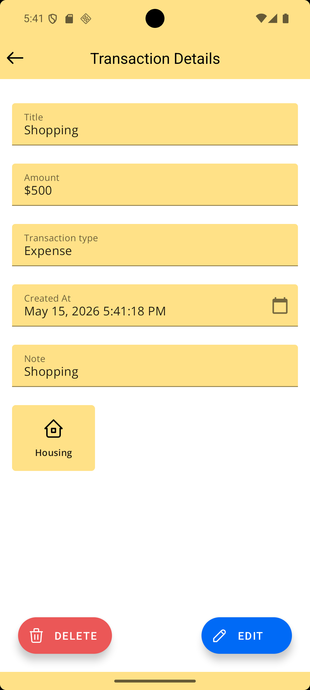

# Expenzilla — Expense Manager

[](LICENSE)
[](https://kotlinlang.org/)
[](https://developer.android.com/)
[](https://github.com/saadkhalidkhan/Expense-Manager/releases)
[](app/build.gradle.kts)
[](app/build.gradle.kts)
[](CONTRIBUTING.md)
[](https://github.com/saadkhalidkhan/Expense-Manager/actions/workflows/android-ci.yml)

A lightweight **personal finance** Android app to track income and expenses, view balances on a dashboard, export data to CSV, and switch between light and dark themes.

[**Download on Google Play**](https://play.google.com/store/apps/details?id=com.droidgeeks.expensemanager) · [**Report a bug**](https://github.com/saadkhalidkhan/Expense-Manager/issues) · [**Contributing**](CONTRIBUTING.md)

---

## Preview

Add these files under [`docs/images/`](docs/images/) (see [guide](docs/images/README.md)), then uncomment the block below in this README:

- `dashboard.png` — main dashboard
- `add_transaction.png` — add / edit screen
- `transaction_details.png` — detail view
- `demo.gif` — short app walkthrough (optional)

<!--
| Dashboard | Add transaction | Transaction details |
| :---: | :---: | :---: |
|  |  |  |


-->

---

## Features

- **Dashboard** — total balance, income, expense, and recent transactions
- **Transactions** — add, edit, view details, and swipe-to-delete (with undo)
- **Filters** — overall, income-only, or expense-only lists
- **Categories** — bonus, food, salary, transport, utilities, and more
- **CSV export** — export transactions for backup or spreadsheets
- **Dark / light theme** — persisted with DataStore
- **Share** — share the app or individual transactions
- **Localization** — multiple language resources (e.g. ES, DE, JA, UR, AR)

---

## Tech stack

| Layer | Tools |
| --- | --- |
| Language | Kotlin |
| UI | XML, View Binding, Data Binding |
| Architecture | MVVM, Repository pattern, Clean Architecture |
| DI | Hilt (Dagger) |
| Database | Room |
| Async | Coroutines, `Flow`, `StateFlow`, LiveData |
| Navigation | Jetpack Navigation + Safe Args |
| Preferences | DataStore |
| Other | Lottie, OpenCSV, Gson, Firebase Analytics & Crashlytics, AdMob |

---

## Getting started

### Prerequisites

- **Android Studio** Hedgehog (2023.1.1) or newer recommended
- **JDK 17**
- **Android SDK** with API **36** (compile) and build-tools installed
- A device or emulator running **API 26+**

### Clone the repository

```bash
git clone https://github.com/saadkhalidkhan/Expense-Manager.git
cd Expense-Manager
```

### Firebase & AdMob (required for a full build)

This project uses **Firebase** (`google-services.json`) and **AdMob**. For your own fork:

1. Create a Firebase project and download `google-services.json` into `app/`.
2. Replace AdMob IDs in `app/src/main/res/values/strings.xml` (`app_id`, `expense_banner`) with your own, or use [Google’s test ad units](https://developers.google.com/admob/android/test-ads) during development.

> Do not commit production API keys or private config you do not intend to share.

### Build & run

```bash
# Debug APK
./gradlew assembleDebug

# Install on a connected device/emulator
./gradlew installDebug
```

Or open the project in Android Studio and run the **app** configuration.

### Run tests

```bash
./gradlew test
./gradlew connectedAndroidTest   # requires a device/emulator
```

### Code style

The project uses **Spotless** with ktlint:

```bash
./gradlew spotlessApply
./gradlew spotlessCheck
```

---

## Usage

1. **Open the app** — the dashboard shows balance, income, expense, and recent activity.
2. **Add a transaction** — tap **+**, enter title, amount, type (income/expense), category, date, and note, then save.
3. **Filter** — use Overall / Income / Expense on the dashboard to narrow the list.
4. **View or edit** — tap a transaction for details; use **Edit** to update or swipe to delete.
5. **Export** — use the export action to save transactions as **CSV** (storage permission may apply on older Android versions).
6. **Theme** — toggle dark/light mode from the dashboard toolbar; the choice is remembered.

---

## Project structure

```
app/src/main/java/com/droidgeeks/expensemanager/
├── app/                 # Application (Hilt)
├── data/local/          # Room entities, DAO, DataStore
├── di/                  # Hilt modules
├── repo/                # Repository layer
├── services/exportcsv/  # CSV export
├── utils/               # Extensions, constants, ViewState
└── view/                # Activities, fragments, adapters, ViewModels
```

---

## Configuration

| Setting | Location |
| --- | --- |
| Application ID | `com.droidgeeks.expensemanager` |
| Version | `1.0` (`versionCode` 1) in `app/build.gradle.kts` |
| Min / target SDK | 26 / 36 |

---

## Contributing

Contributions are welcome. Please read [CONTRIBUTING.md](CONTRIBUTING.md) and our [Code of Conduct](CODE_OF_CONDUCT.md) before opening an issue or pull request.

1. Open an issue to discuss your change.
2. Fork the repo and create a branch from `master`.
3. Open a pull request with a clear description and screenshots when UI changes.

---

## License

This project is licensed under the **Apache License 2.0** — see [LICENSE](LICENSE).

```
Copyright 2026 Saad Khan
```

---

## Author

**Saad Khan** — [GitHub](https://github.com/saadkhalidkhan) · [ranasaad0799@gmail.com](mailto:ranasaad0799@gmail.com)

If this project helps you, consider starring the repo or leaving a review on [Google Play](https://play.google.com/store/apps/details?id=com.droidgeeks.expensemanager).
